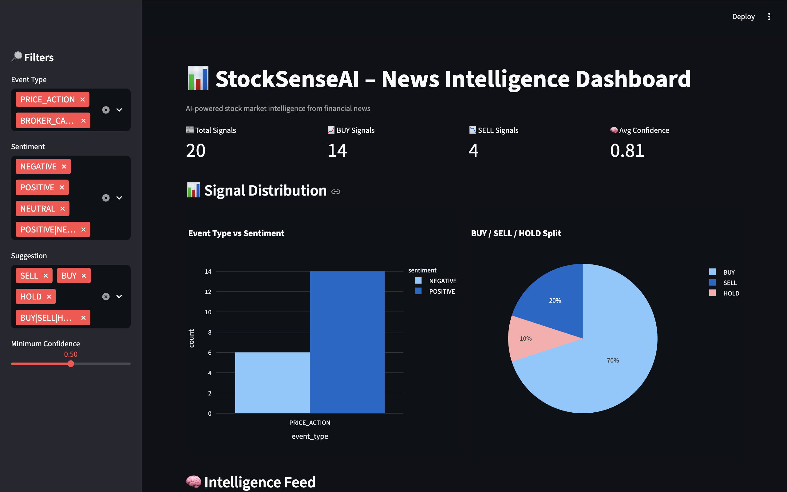
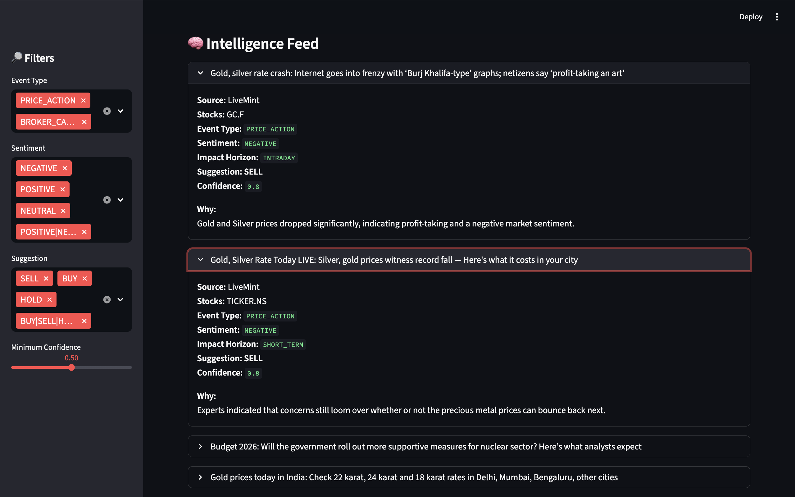
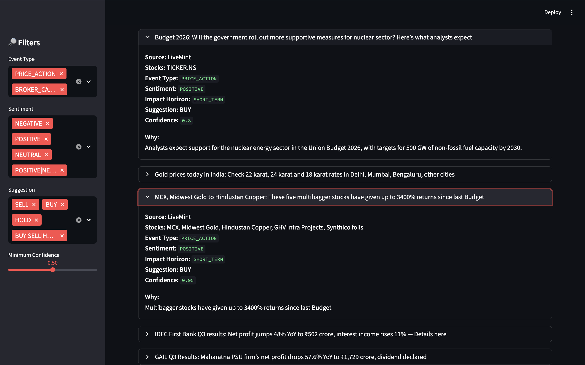

##                                                                   📊 StockSenseAI

StockSenseAI is an AI-powered financial intelligence system that transforms real-time market news into structured, explainable stock signals using Large Language Models (LLMs), semantic deduplication, and event-driven analysis — designed for traders, investors, and research use.

🚀 Key Features

🔎 Multi-source News Aggregation
Collects financial news from multiple free Indian market sources.

🧹 Smart News Cleaning & Deduplication
Uses semantic logic to avoid storing duplicate or low-signal news.

🧠 LLM-Based Financial Intelligence Extraction
Converts raw news into structured insights:

Stocks involved

Event type (Broker call, Macro, Fund flow, etc.)

Sentiment (Positive / Neutral / Negative)

Impact horizon

Action suggestion (Buy / Sell / Hold)

Confidence + reasoning

🗃 Relational + Vector-Ready Database Design
Stores raw news and LLM outputs in normalized SQLite tables.

📈 Market-Ready Signal Format
Outputs signals usable for dashboards, backtesting, or trading engines.

📊 Streamlit Dashboard (No Server Required)
Visualize insights locally with zero backend deployment.

🧠 Intelligence Pipeline
News Sources
     ↓
News Cleaning & Filtering
     ↓
Duplicate Detection
     ↓
LLM Information Extraction
     ↓
Structured Signal Storage
     ↓
Dashboard / Analytics

🧩 Event Types Detected

BROKER_CALL – Analyst ratings, targets

FUND_FLOW – Mutual funds, smart money

MACRO – Inflation, rates, economy

PRICE_ACTION – Rallies, crashes, results

GLOBAL – International market effects

🧪 Example LLM Output
{
  "stocks": ["HDFCBANK.NS"],
  "event_type": "BROKER_CALL",
  "sentiment": "POSITIVE",
  "impact_horizon": "LONG_TERM",
  "suggestion": "BUY",
  "confidence": 0.95,
  "reasoning": "Broker upgrade with strong target price"
}

🛠 Tech Stack
Layer	Technology
Language	Python
LLM	Groq (LLaMA-3.1 API)
Database	SQLite
Finance Data	yFinance
Visualization	Plotly
Dashboard	Streamlit

⚙️ Installation & Setup
1️⃣ Clone Repository
git clone https://github.com/danny8806/StockSenseAI.git
cd StockSenseAI

2️⃣ Install Dependencies
pip install -r requirements.txt

3️⃣ Set API Key
export GROQ_API_KEY="your_api_key_here"

(On Windows use set instead of export)

▶️ Run Pipeline (Local)

Run news processing scripts as needed, then launch dashboard:

streamlit run dashboard/dashboard.py

📊 Dashboard Preview

## 📊 Dashboard Preview

  

  

  

🎯 Use Cases

Retail & professional traders

Quant research

Market sentiment analysis

News-driven trading systems

Academic / portfolio projects

🔮 Roadmap

⏱ Price reaction analysis after news

🧠 Historical news impact memory

🧩 Vector search for similar past events

📉 Backtesting signals

🤖 Agent-based reasoning layer

⚠️ Disclaimer

This project is for educational and research purposes only.
It is not financial advice. Always perform your own analysis.

👤 Author

Dnyaneshwar Jadhav
📧 jadhavdnyaneshwar701@gmail.com
