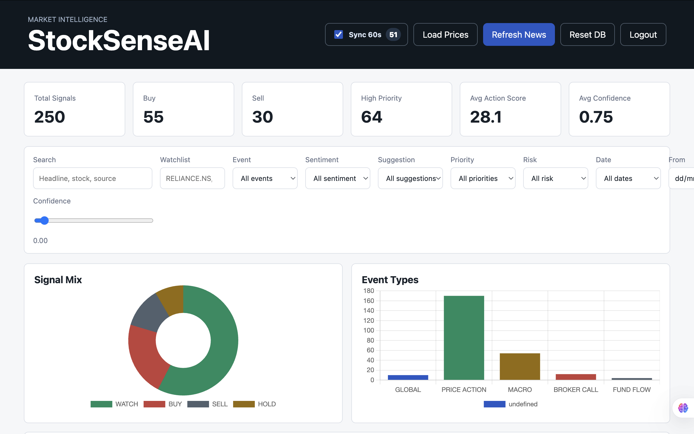
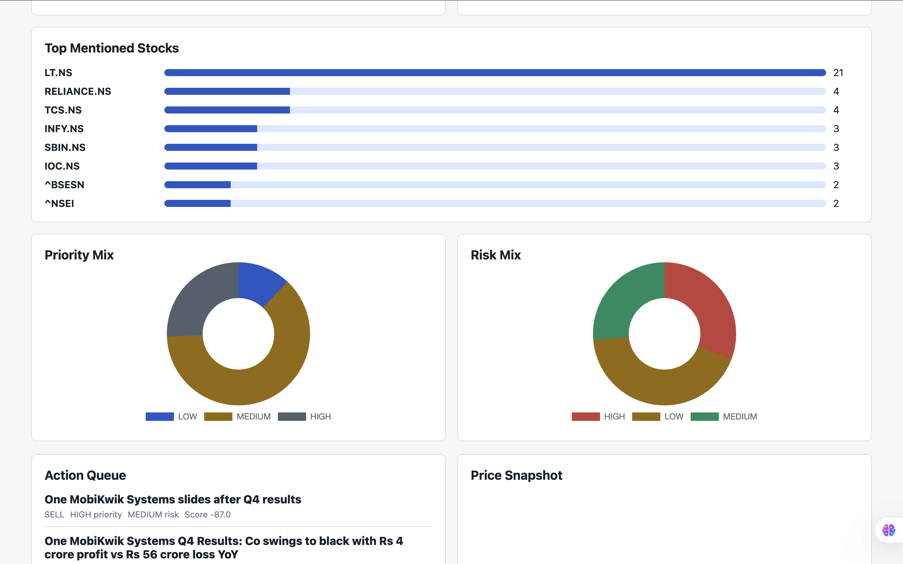
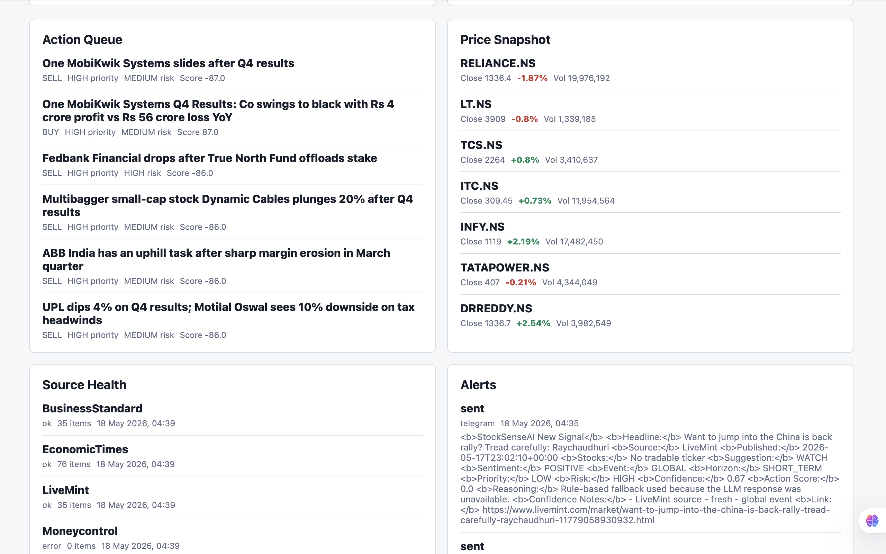
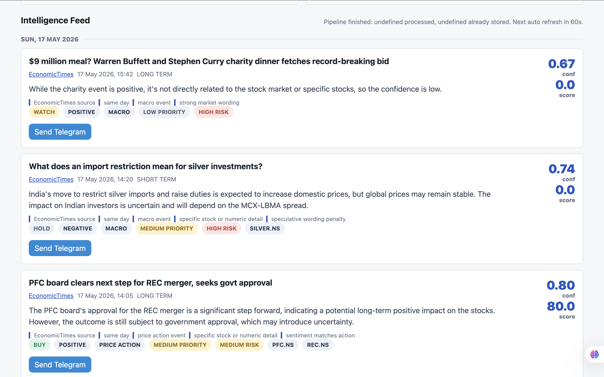
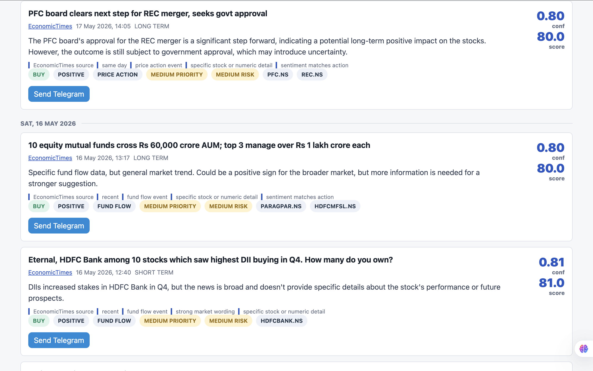
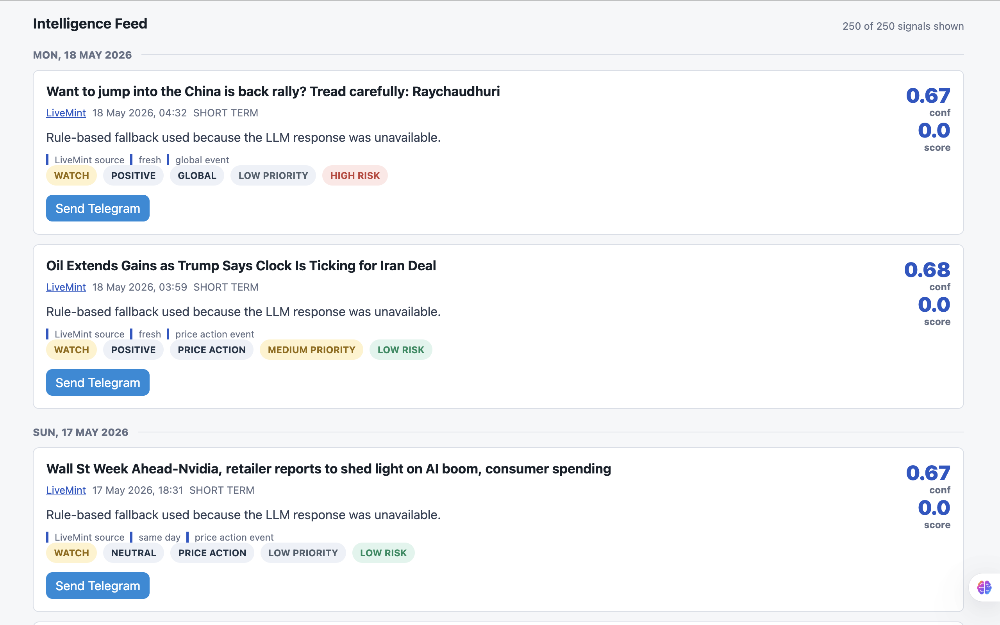

# StockSenseAI

StockSenseAI is an AI-powered market-news intelligence app for Indian equities. It collects RSS market news, removes duplicates, extracts structured trading signals with Groq LLMs, stores everything in SQLite, and presents the results in a Flask web dashboard.

## Dashboard Preview

### 1. Main dashboard overview

This is the primary operating view of StockSenseAI. It shows top-level KPIs, sync status, manual refresh controls, watchlist filtering, date filtering, confidence filtering, and chart-based summaries for quick market scanning.



### 2. Market analytics and stock concentration

This section highlights which tickers are being mentioned most often, along with the current priority mix and risk mix across all generated signals. It helps surface where the news flow is concentrated and how aggressive or cautious the signal set looks.



### 3. Action queue, live prices, source health, and alert log

The dashboard also includes an action queue for the strongest trading ideas, a live price snapshot for tracked tickers, RSS source health monitoring, and an alerts panel that records outbound Telegram or webhook deliveries.



### 4. Intelligence feed with signal cards

Each news card in the intelligence feed contains the article source, published time, horizon, confidence, score, reasoning, priority, risk, mapped stocks, and a manual Telegram send button. This is the core analyst workflow for reviewing one signal at a time.



### 5. Date-grouped feed for time-based review

Signals are grouped by date so you can review news chronologically. This makes it easier to scan today’s stories separately from previous trading sessions.



### 6. Fallback view when the LLM is unavailable

If the Groq LLM is unavailable, the app still keeps the feed running by using a rule-based fallback. This preserves continuity and makes failures visible instead of silently dropping news items.



## Features

- Multi-source RSS ingestion from Moneycontrol, Economic Times, LiveMint, Business Standard, and NSE feeds.
- Stable news IDs to avoid repeated inserts across runs.
- Fast lexical deduplication by default, with optional semantic deduplication through Sentence Transformers and persistent ChromaDB.
- Groq/OpenAI-compatible LLM extraction with a rule-based fallback.
- Structured signals: stocks, event type, sentiment, impact horizon, suggestion, confidence, and reasoning.
- Calibrated confidence, action score, priority, risk level, and confidence reasons for each signal.
- SQLite schema with raw news and normalized LLM signal tables.
- Protected web dashboard with KPIs, filters, watchlist mode, charts, top stock mentions, action queue, live price snapshot, source health, alerts, refresh, and reset controls.
- Server-side scheduler keeps fetching news even when the browser is closed.
- Ticker cleanup removes generic/non-tradable placeholders before display.
- Optional webhook alerting for high-priority BUY/SELL signals.
- Telegram delivery for newly processed stories, once per news item.
- JSON APIs for dashboard data, pipeline execution, source health, alerts, scheduler status, stock history, and reset operations.

## Project Flow

```text
RSS feeds
  -> clean and normalize news
  -> semantic duplicate check
  -> LLM or fallback extraction
  -> SQLite storage
  -> Flask webpage and APIs
```

## Setup

```bash
python3 -m venv venv
source venv/bin/activate
pip install -r requirements.txt
```

Create a `.env` file:

```bash
GROQ_API_KEY=your_api_key_here
GROQ_MODEL=llama-3.1-8b-instant
STOCKSENSE_DB_PATH=news.db
STOCKSENSE_CHROMA_PATH=.chroma
STOCKSENSE_ENABLE_SEMANTIC_DEDUPE=0
STOCKSENSE_AUTH_ENABLED=1
STOCKSENSE_ADMIN_USERNAME=admin
STOCKSENSE_ADMIN_PASSWORD=change-this-password
STOCKSENSE_SECRET_KEY=change-this-secret
STOCKSENSE_SERVER_SCHEDULER_ENABLED=1
STOCKSENSE_SERVER_REFRESH_SECONDS=60
STOCKSENSE_ALERT_WEBHOOK_URL=
STOCKSENSE_WATCHLIST=RELIANCE.NS,TCS.NS,HDFCBANK.NS
STOCKSENSE_TELEGRAM_ENABLED=1
STOCKSENSE_TELEGRAM_BOT_TOKEN=
STOCKSENSE_TELEGRAM_CHAT_ID=
```

Set `STOCKSENSE_ENABLE_SEMANTIC_DEDUPE=1` when you want ChromaDB + Sentence Transformers semantic duplicate detection.

## Run The Pipeline

```bash
python main.py
```

## Run The Web Dashboard

```bash
python app.py
```

Open:

```text
http://127.0.0.1:5000
```

Default local login from `.env`:

```text
admin / stocksense
```

## API Endpoints

- `GET /api/dashboard` returns signals and summary analytics.
- `GET /api/signals` returns filtered signal data.
- `GET /api/quotes` returns a yFinance price snapshot for selected tickers.
- `GET /api/source-health` returns RSS feed health.
- `GET /api/alerts` returns alert delivery/log entries.
- `GET /api/scheduler` returns server-side refresh status.
- `GET /api/stock/<ticker>` returns stock-specific signal history.
- `POST /api/run-pipeline` fetches and processes fresh news.
- `POST /api/reset-db` clears the database and vector store.

## Publish

Use a strong `.env` password and secret before deployment. A basic Dockerfile is included:

```bash
docker build -t stocksenseai .
docker run --env-file .env -p 5000:5000 stocksenseai
```

For Telegram delivery, send `/start` to your bot, then set `STOCKSENSE_TELEGRAM_CHAT_ID` to your chat id.

## Database

`news_raw` stores source news:

- `news_id`
- `source`
- `headline`
- `full_text`
- `url`
- `published_at`
- `fetched_at`

`news_llm` stores extracted intelligence:

- `stocks`
- `event_type`
- `sentiment`
- `impact_horizon`
- `suggestion`
- `confidence`
- `signal_score`
- `priority`
- `risk_level`
- `confidence_reasons`
- `price_at_signal`
- `price_checked_at`
- `price_change_pct`
- `reasoning`
- `model_name`
- `processed_at`

## Disclaimer

This project is for education, research, and prototyping only. It is not financial advice.

## Author

Designed and built by Dnyaneshwar Jadhav  
Phone: 8806160767

GitHub: [danny8806/StockSenseAI](https://github.com/danny8806/StockSenseAI)
